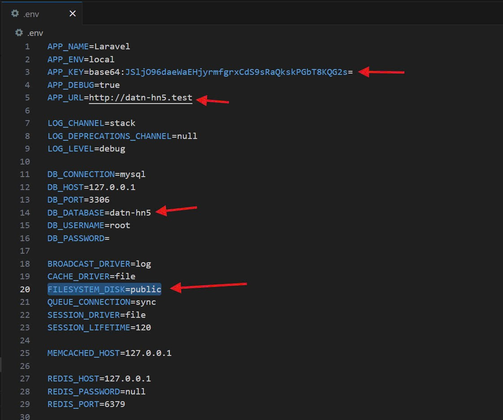

Các bạn kéo code về thì làm theo các bước sau rồi mới chạy code
- composer update
- tạo file .env, copy toàn bộ nội dung trong file .env.example sang rồi thay giá trị tương ứng vào
- Riêng APP_KEY chạy lệnh: php artisan key:gen
- php artisan migrate
- php artisan storage:link
- Chạy câu lệnh: "composer install" để dùng được gói Laravel UI

1. Cấu hình queue 
- mở file env cấu hình QUEUE_CONNECTION=database
- chạy php artisan queue:table để tạo migrate job_table (cái này tôi chạy rồi anh có trong code rồi anh em không cần phải chạy lại)

2. tại sao phải dùng queue và cách sử dụng
- đối với gửi email thì khá là lâu, nhằm tăng trải nghiệm người dùng thì sẽ dùng queue 
- đối với những tác vụ không ảnh hưởng trực tiếp trên luồng chính và có thể xử lý sau được thì ném hết vào queue ví dụ như gửi mail 
- sử dụng queue thì chỉ cần implements ShouldQueue vào là xong 
- để chạy được queue thì chạy php aritisan queue:work hoặc queue:listen. để ngắt thì Ctrl +C 
- đối với chạy trên hosting thì queue:listen

3. Đăng nhập bằng google 
- php artisan ser
- ENV: 

[//]: # (GOOGLE_CLIENT_ID="484709232894-5vvb3cg57qggodm9v6hgbdvcd6o4n34i.apps.googleusercontent.com")

[//]: # (GOOGLE_CLIENT_SECRET="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")

[//]: # (GOOGLE_CALLBACK_URL="http://127.0.0.1:8000/auth/google/callback")

